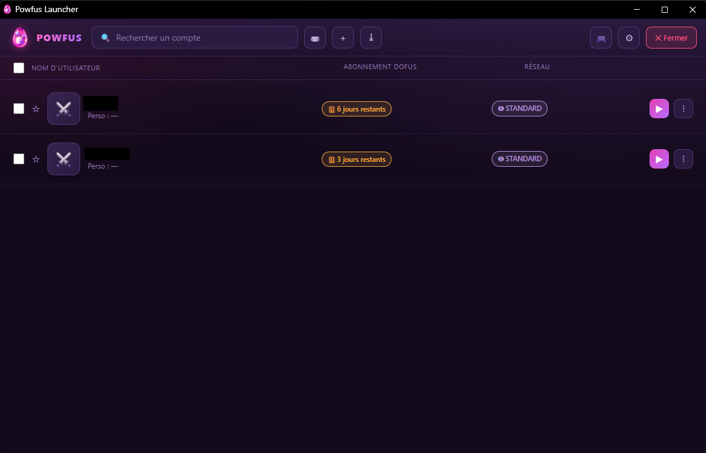
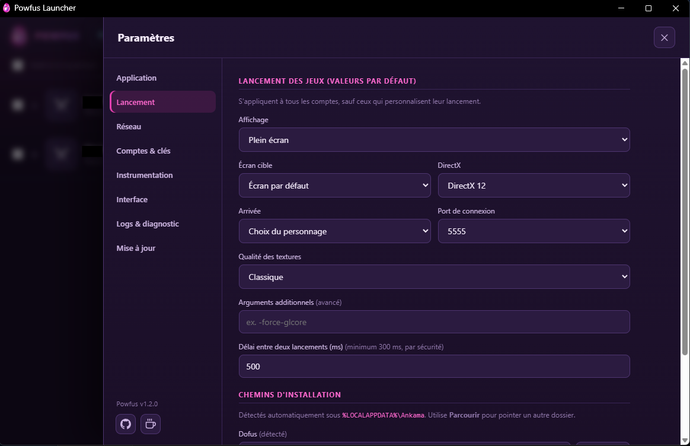

# Powfus Launcher

**Le launcher multi-compte de Dofus, simple et respectueux de tes identifiants.**

**🇫🇷 Français** · [🇬🇧 English](README.en.md)

---

> ⚠️ **Outil tiers, non affilié à Ankama.** Le multi-compte et l'instrumentation du client peuvent
> enfreindre les CGU des jeux concernés. Usage strictement **personnel**, sur **tes propres comptes**,
> à tes risques.

## C'est quoi ?

**Powfus** est un launcher qui te permet de lancer et gérer **plusieurs comptes Dofus** en parallèle,
depuis une seule fenêtre claire. Il remplace le launcher officiel pour le multi-compte, avec :

- ▶️ **lancement en un clic**, un ou plusieurs comptes à la fois ;
- 🖼️ **fenêtres positionnées** comme tu veux (plein écran, écran choisi, taille, multi-écran) ;
- 🌐 **une IP dédiée ou un proxy par compte** (indispensable sur Dofus Retro, 1 compte par IP) ;
- ⭐ **favoris, tags, recherche**, suivi de l'abonnement (« X jours restants ») et du personnage ;
- ⌨️ **raccourcis clavier** pour basculer entre les fenêtres ;
- 🎨 **4 thèmes** et une interface qui va à l'essentiel ;
- 🌍 **interface en 5 langues** : français, anglais, espagnol, allemand, portugais.

 <em>La liste des comptes : lance, organise, surveille.</em>

## 🔒 Tes identifiants restent chez toi

C'est le point le plus important, alors soyons clairs :

| Question | Réponse |
| --- | --- |
| **Mon mot de passe est-il stocké ?** | **Non, jamais.** Tu te connectes sur la **page officielle d'Ankama** ; Powfus ne lit ni ne stocke ton mot de passe. Seule une **clé d'accès** est conservée. |
| **Cette clé est-elle en clair ?** | **Non.** Elle est chiffrée au repos en **AES-256-GCM**, avec une clé **dérivée de ta machine** et jamais enregistrée. Un dossier de données copié sur un autre PC **ne se déchiffre pas**. |
| **Powfus contacte-t-il un serveur à moi ?** | **Non.** Aucun serveur distant, aucun cloud, aucune licence en ligne, **aucune télémétrie**. Powfus ne parle qu'aux **services officiels d'Ankama**, exactement comme le ferait le launcher officiel. |
| **Peut-il me voler un token ?** | **Non.** Rien ne quitte ta machine vers un tiers. L'interface tourne **en local** (`127.0.0.1`) et refuse toute origine étrangère. |
| **Puis-je vérifier ?** | Oui : le launcher inclut un **rapport de diagnostic** qui montre exactement ce qu'il utilise, sans aucun secret. |

> En résumé : **Powfus se comporte comme le launcher officiel** vis-à-vis d'Ankama, avec en plus le
> confort du multi-compte. Il n'ajoute **aucun intermédiaire** entre toi et Ankama.

## 📥 Installation

1. **Télécharge** le fichier `Powfus-1.2.2.msi` depuis la [page des releases](../../releases/latest).
2. **Double-clique** dessus. Windows peut afficher un écran bleu **« Windows a protégé votre
   ordinateur »** (SmartScreen) : c'est normal pour une application récente et **non signée par un
   gros éditeur**, ce n'est pas un signe de virus. Clique sur **« Informations complémentaires »**
   puis **« Exécuter quand même »**.
3. Suis l'assistant (bienvenue → licence → dossier → installation).
4. Lance **Powfus** depuis le **Menu Démarrer** ou le **raccourci Bureau**.

### Premier lancement

- **Importer tes comptes** depuis le launcher Ankama (le plus rapide), **ou**
- **Ajouter un compte manuellement** : Powfus ouvre la page de connexion **officielle** d'Ankama,
  tu t'y connectes, et c'est tout.

### Prérequis

- **Windows 10 / 11 (64 bits)**
- **Dofus installé** via le launcher Ankama
- Un navigateur **Chromium** (Chrome, Edge, Brave…) pour la fenêtre de l'app et la connexion Ankama

## ⚙️ Les réglages en bref

Le panneau de paramètres est organisé en sections :

| Section | À quoi ça sert |
| --- | --- |
| **Application** | Thème, langue, port local, démarrage avec Windows, dossier de données |
| **Lancement** | Affichage par défaut (plein écran, écran, taille…), délai entre deux lancements, chemins des jeux |
| **Réseau** | Proxy SOCKS5 par défaut, IP locales détectées (pour l'IP dédiée par compte) |
| **Comptes & clés** | État des clés d'accès (informatif) et vérification à la demande |
| **Instrumentation** | Réglages avancés (mode d'injection, empreinte) — avec avertissements |
| **Interface** | Colonnes affichées, tri, densité, confirmations |
| **Logs & diagnostic** | Niveau de journalisation, dossier des logs, rapport de diagnostic |

 <em>Des réglages clairs, avec des valeurs par défaut sûres.</em>

## ❓ FAQ

**Est-ce un bot / un cheat ?**
Non. Powfus lance le **client officiel** et t'aide à gérer plusieurs fenêtres. Il ne joue pas à ta
place et ne modifie pas le gameplay.

**Vais-je me faire bannir ?**
Le multi-compte et l'instrumentation peuvent enfreindre les CGU selon le serveur (surtout mono-compte
comme Dofus Retro). C'est un choix et un risque que **tu assumes**, sur tes propres comptes.

**Mes données partent-elles quelque part ?**
Non. Tout reste en local sur ta machine. Voir la section [🔒 sécurité](#-tes-identifiants-restent-chez-toi).

## ☕ Soutenir le projet

Powfus est développé sur mon temps libre, gratuitement. Si l'outil t'est utile :

---

Powfus n'est pas affilié à Ankama Games. Dofus est une marque d'Ankama.
Projet à usage personnel, fourni « en l'état », sans garantie.

